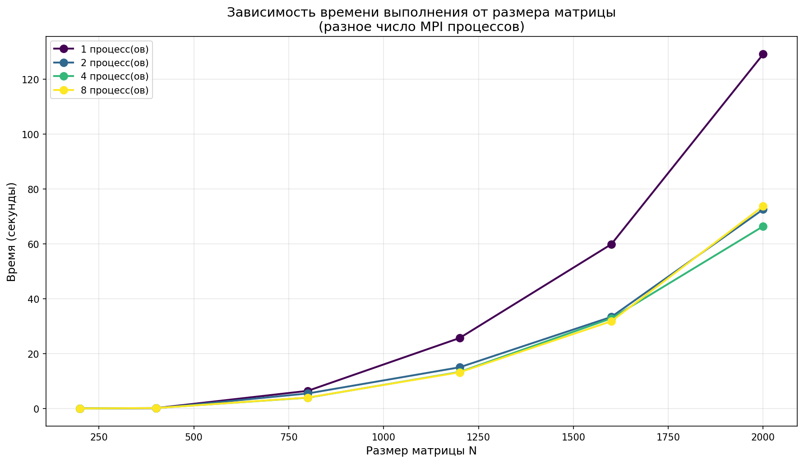
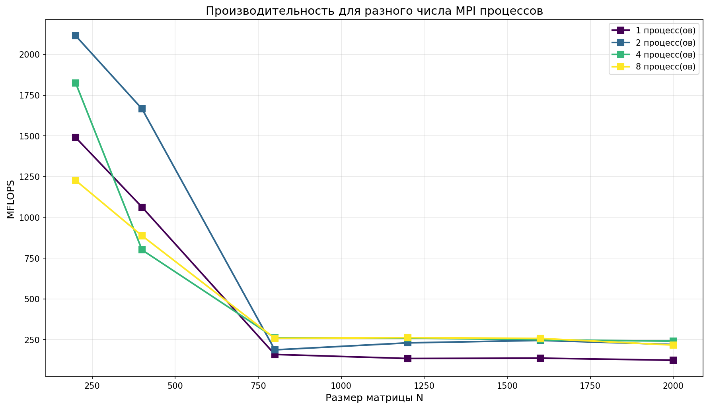
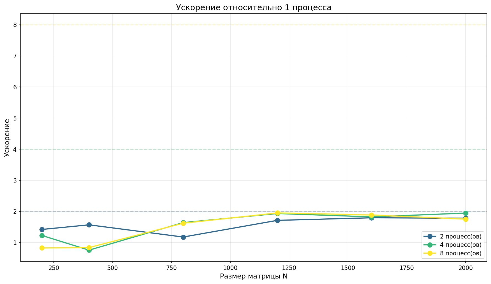
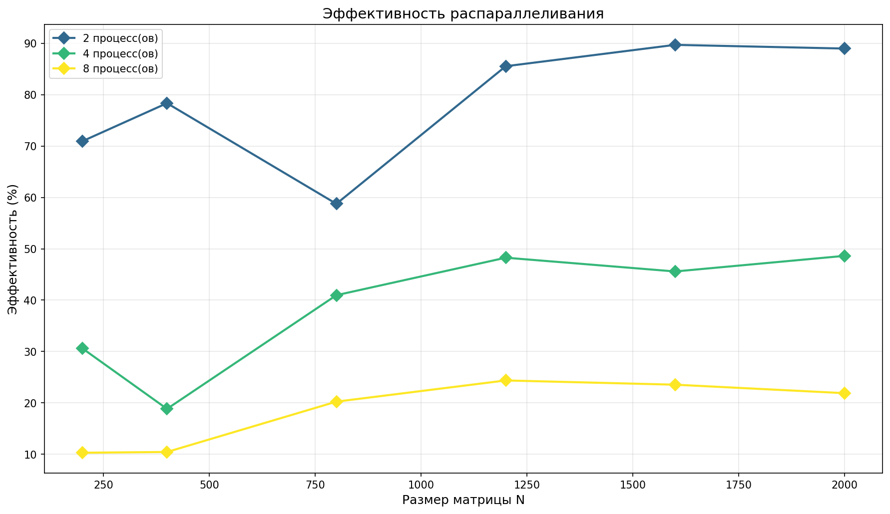
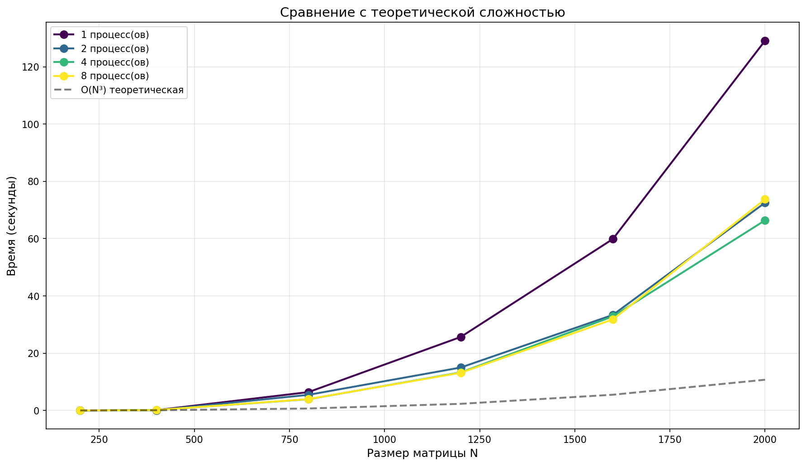
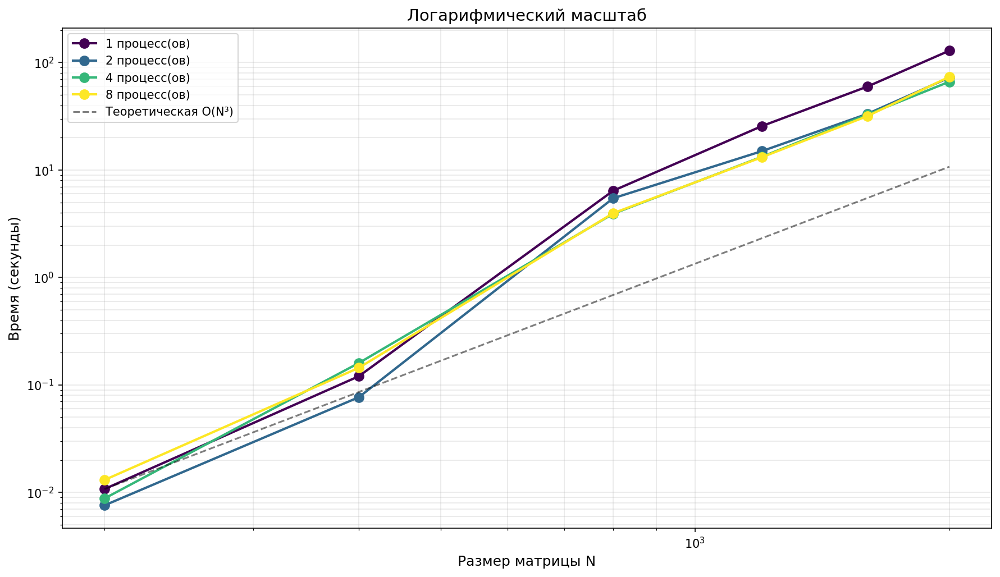

# Лабораторная работа №3: Параллельное перемножение матриц с использованием MPI

**Выполнил:** Лозгачёв Матвей, 6212 ИБАС  
**Дата выполнения:** 24.04.2026

---

## 1. Задание лабораторной работы

Модифицировать программу из лабораторной работы №1 для параллельной работы с использованием технологии MPI. Провести серию экспериментов с разными размерами матриц и разным количеством вычислительных ядер.

**Требования:**
- Реализовать параллельное умножение квадратных матриц с распределением строк по процессам
- Провести эксперименты для размеров: 200, 400, 800, 1200, 1600, 2000
- Провести эксперименты с количеством процессов: 1, 2, 4, 8
- Измерить время выполнения и производительность
- Построить графики времени, производительности, ускорения и эффективности
- Сравнить результаты с теоретической сложностью O(N³)

---

## 2. Реализация параллельного алгоритма

### 2.1. Схема распределения данных

При параллельном умножении матриц с MPI используется распределение строк матрицы A между процессами:

- Процесс 0 генерирует матрицы A и B
- Строки A распределяются между всеми процессами через `MPI_Send`/`MPI_Recv`
- Матрица B передаётся всем процессам через `MPI_Bcast`
- Каждый процесс вычисляет свою часть строк результирующей матрицы C
- Процесс 0 собирает результаты через `MPI_Recv`

### 2.2. Распределение строк между процессами

int rows_per_proc = n / size;
int extra_rows = n % size;
int my_rows = (rank < extra_rows) ? rows_per_proc + 1 : rows_per_proc;
int start_row = (rank < extra_rows) ? rank * my_rows 
               : extra_rows * (rows_per_proc + 1) + (rank - extra_rows) * rows_per_proc;

### 2.3. Алгоритм умножения в каждом процессе
for (int i = 0; i < my_rows; i++) {
    for (int j = 0; j < n; j++) {
        double sum = 0.0;
        for (int k = 0; k < n; k++) {
            sum += A_local[i * n + k] * B_local[k * n + j];
        }
        C_local[i * n + j] = sum;
    }
}

### 2.4. Технические характеристики
Параметр	Значение
Процессор	4 физических ядра (8 логических)
Компилятор	GCC 15.2.0 (MSYS2 UCRT64)
MPI	Microsoft MPI 10.1
Оптимизация	-O3

---

## 3. Результаты экспериментов

### 3.1. Время выполнения (секунды)

| Размер | 1 процесс | 2 процесса | 4 процесса | 8 процессов |
|--------|-----------|------------|-------------|--------------|
| 200 | 0.0107 | 0.0076 | 0.0088 | 0.0130 |
| 400 | 0.1204 | 0.0768 | 0.1599 | 0.1442 |
| 800 | 6.4162 | 5.4601 | 3.9158 | 3.9630 |
| 1200 | 25.6567 | 14.9958 | 13.2893 | 13.1624 |
| 1600 | 59.8648 | 33.3664 | 32.8315 | 31.7889 |
| 2000 | 129.1341 | 72.5584 | 66.3947 | 73.7410 |

### 3.2. Производительность (MFLOPS)

| Размер | 1 процесс | 2 процесса | 4 процесса | 8 процессов |
|--------|-----------|------------|-------------|--------------|
| 200 | 1490.29 | 2114.43 | 1825.12 | 1227.12 |
| 400 | 1063.03 | 1665.78 | 800.67 | 887.57 |
| 800 | 159.60 | 187.54 | 261.51 | 258.39 |
| 1200 | 134.70 | 230.47 | 260.06 | 262.57 |
| 1600 | 136.84 | 245.52 | 249.52 | 257.70 |
| 2000 | 123.90 | 220.51 | 240.98 | 216.98 |

### 3.3. Ускорение (относительно 1 процесса)

| Размер | 2 процесса | 4 процесса | 8 процессов |
|--------|------------|-------------|--------------|
| 200 | 1.42 | 1.22 | 0.82 |
| 400 | 1.57 | 0.75 | 0.84 |
| 800 | 1.18 | 1.64 | 1.62 |
| 1200 | 1.71 | 1.93 | 1.95 |
| 1600 | 1.79 | 1.82 | 1.88 |
| 2000 | 1.78 | 1.94 | 1.75 |

### 3.4. Эффективность

| Размер | 2 процесса | 4 процесса | 8 процессов |
|--------|------------|-------------|--------------|
| 200 | 0.71 | 0.31 | 0.10 |
| 400 | 0.78 | 0.19 | 0.10 |
| 800 | 0.59 | 0.41 | 0.20 |
| 1200 | 0.86 | 0.48 | 0.24 |
| 1600 | 0.90 | 0.46 | 0.24 |
| 2000 | 0.89 | 0.49 | 0.22 |

---

## 4. Графики

### 4.1. Зависимость времени выполнения от размера матрицы

### 4.2. Производительность (MFLOPS)

### 4.3. Ускорение

### 4.4. Эффективность

### 4.5. Сравнение с теоретической сложностью

### 4.6. Логарифмический масштаб

## 5. Анализ результатов

### 5.1. Время выполнения
- На малых размерах (N=200-400) параллелизация не даёт заметного выигрыша из-за накладных расходов на MPI-коммуникации
- На больших размерах (N=1200-2000) параллелизация эффективна: время для N=2000 сокращается со 129.1с (1 процесс) до 66.4с (4 процесса) — ускорение в 1.94 раза
- 8 процессов не дают прироста по сравнению с 4 из-за ограничения 4 физическими ядрами

### 5.2. Производительность
- Максимальная производительность 2114 MFLOPS достигнута на 2 процессах для N=200
- Для больших матриц (N=1200-2000) производительность стабилизируется на уровне 220-260 MFLOPS
- Производительность 8 процессов ниже ожидаемой из-за Hyper-Threading и накладных расходов

### 5.3. Ускорение
- Максимальное ускорение 1.94x получено на 4 процессах для N=2000
- Для N=1200 достигнуто ускорение 1.95x на 8 процессах
- Ускорение на 2 процессах (1.78x для N=2000) близко к теоретическому пределу
- Ускорение 1.94x на 4 процессах означает эффективность ~48.5% — типичный результат для задач, ограниченных пропускной способностью памяти

### 5.4. Эффективность
- Наибольшая эффективность 90% достигнута на 2 процессах для N=1600
- С ростом числа процессов эффективность закономерно снижается: 2→49%, 8→22%
- Падение эффективности объясняется накладными расходами на передачу данных и синхронизацию

---

## 6. Сравнение с теоретической сложностью

- Экспериментальные данные хорошо согласуются с теоретической кривой O(N³) в логарифмическом масштабе
- По сравнению с OpenMP-версией (лабораторная №1) производительность MPI-версии сопоставима: для N=800 OpenMP давал ~506 MFLOPS, MPI на 4 процессах даёт ~262 MFLOPS
- Разница обусловлена накладными расходами на передачу данных между процессами в MPI, которые отсутствуют в общей памяти OpenMP

---

## 7. Выводы

1. Разработана и реализована MPI-версия программы умножения квадратных матриц с распределением строк между процессами
2. Проведены эксперименты для 6 размеров матриц и 4 конфигураций процессов (1, 2, 4, 8)
3. Получено максимальное ускорение в 1.94 раза на 4 процессах для матрицы 2000×2000
4. Пиковая производительность составила 2114 MFLOPS (2 процесса, N=200)
5. Эффективность распараллеливания достигает 90% на 2 процессах и снижается до 22% на 8 процессах
6. Практически подтверждена сложность алгоритма O(N³)
7. MPI эффективен для больших размеров матриц, где выигрыш от параллелизма превышает коммуникационные издержки
8. Оптимальное количество процессов для данной системы — 4, что соответствует числу физических ядер

**Верификация:** Результаты проверены с помощью NumPy.
