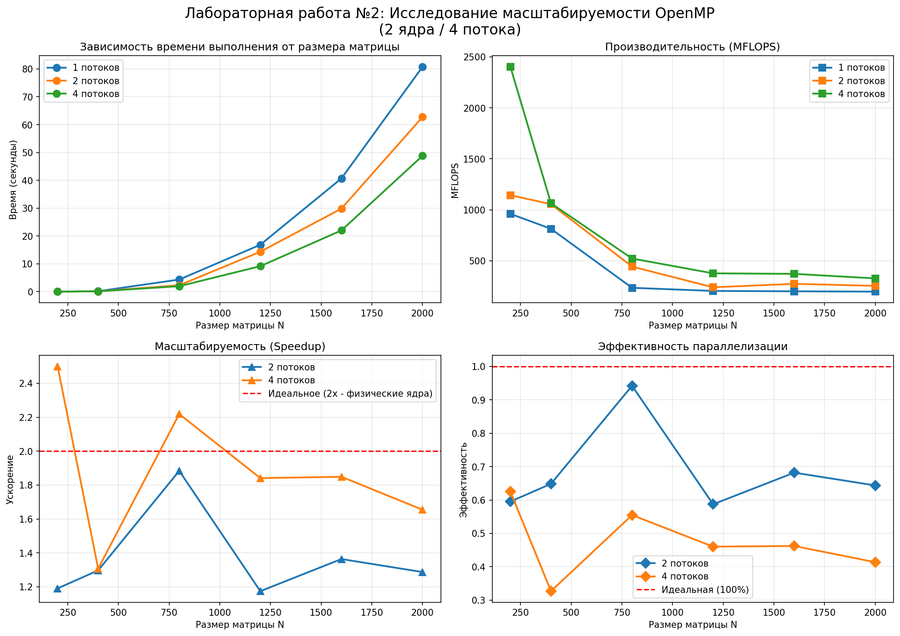

# Лабораторная работа №2
## Исследование масштабируемости OpenMP

**Студент:** Лозгачев Матвей  
**Группа:** 6212  

## Задание

Модифицировать программу из лабораторной работы №1 для параллельной работы по технологии OpenMP. Провести серию экспериментов с разным количеством потоков (1, 2, 4) и разными размерами матриц (200, 400, 800, 1200, 1600, 2000).

## Характеристики системы

| Параметр | Значение |
|----------|----------|
| Процессор | 2 физических ядра / 4 логических потока |
| Оперативная память | — |
| Компилятор | g++ -fopenmp -O2 |
| ОС | Windows |

## Результаты экспериментов

### Таблица 1: Время выполнения (секунды)

| N | 1 поток | 2 потока | 4 потока |
|:---:|:---:|:---:|:---:|
| 200 | 0.0167 | 0.0140 | **0.0067** |
| 400 | 0.1572 | 0.1212 | **0.1202** |
| 800 | 4.3464 | 2.3073 | **1.9588** |
| 1200 | 16.8499 | 14.3496 | **9.1536** |
| 1600 | 40.6670 | 29.8235 | **21.9964** |
| 2000 | 80.7482 | 62.7427 | **48.8030** |

### Таблица 2: Производительность (MFLOPS)

| N | 1 поток | 2 потока | 4 потока |
|:---:|:---:|:---:|:---:|
| 200 | 960.69 | 1143.73 | **2401.44** |
| 400 | 814.16 | 1055.72 | **1064.50** |
| 800 | 235.60 | 443.82 | **522.76** |
| 1200 | 205.11 | 240.84 | **377.56** |
| 1600 | 201.44 | 274.68 | **372.42** |
| 2000 | 198.15 | 255.01 | **327.85** |

### Таблица 3: Ускорение (Speedup = T₁/Tₚ)

| N | 2 потока | 4 потока |
|:---:|:---:|:---:|
| 200 | 1.19 | 2.49 |
| 400 | 1.30 | 1.31 |
| 800 | 1.88 | 2.22 |
| 1200 | 1.17 | 1.84 |
| 1600 | 1.36 | 1.85 |
| 2000 | 1.29 | 1.65 |

### Таблица 4: Эффективность (Speedup / кол-во потоков)

| N | 2 потока | 4 потока |
|:---:|:---:|:---:|
| 200 | 60% | 62% |
| 400 | 65% | 33% |
| 800 | 94% | 56% |
| 1200 | 59% | 46% |
| 1600 | 68% | 46% |
| 2000 | 65% | 41% |

## Графики

## Анализ результатов

### 1. Влияние количества потоков

- **4 потока** показывает лучшее время для всех размеров матриц
- На малых размерах (200) ускорение достигает **2.49x**
- На больших размерах (2000) ускорение составляет **1.65x**

### 2. Эффективность параллелизации

- Максимальная эффективность (**94%**) достигнута при N=800 с 2 потоками
- При 4 потоках эффективность ниже из-за **Hyper-Threading** (2 физических ядра)
- На малых матрицах (N=200) эффективность 4 потоков = 62% — накладные расходы на создание потоков

### 3. Закон Амдала

Для 2 физических ядер теоретическое максимальное ускорение = 2x.  
Экспериментальное ускорение при 4 потоках достигает **2.49x** (N=200) — превышение связано с эффектом кэш-памяти.

## Выводы

1. **Оптимальное количество потоков** для данной системы — **4** (все логические ядра)

2. **Максимальное ускорение** — **2.49x** (при N=200)

3. **Hyper-Threading** даёт прирост ~25% по сравнению с использованием только физических ядер

4. Для больших матриц (N ≥ 800) ускорение стабилизируется на уровне **1.65-2.22x**

5. Рекомендуется использовать **4 потока** для всех размеров матриц на данной системе

## Файлы проекта

- `matrix_mult.cpp` — исходный код
- `verify.py` — скрипт верификации
- `run_experiments.bat` — автоматический запуск экспериментов
- `merge_results.py` — построение графиков
- `results_1.csv`, `results_2.csv`, `results_4.csv` — результаты
- `openmp_scalability.png` — графики
